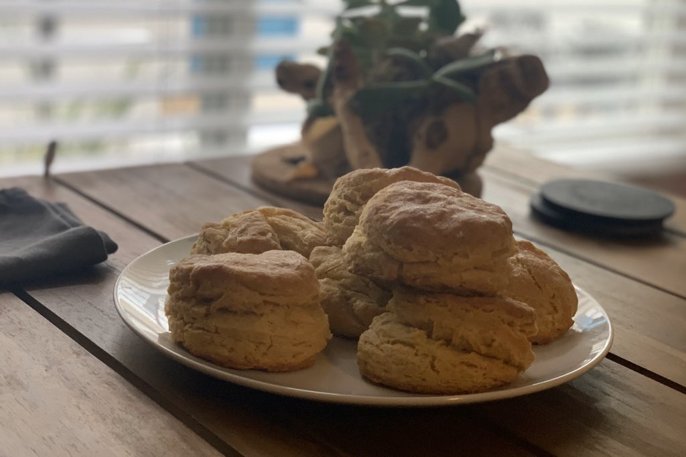
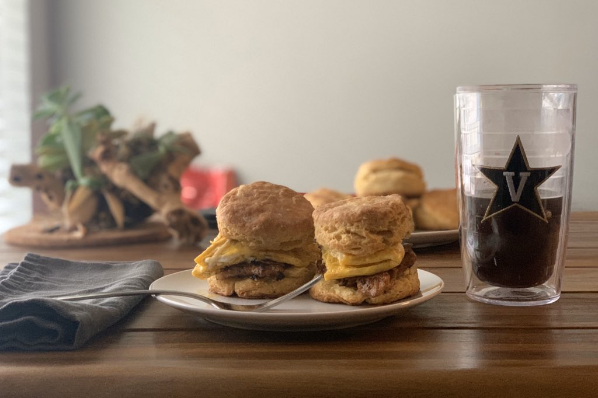

# Buttermilk Biscuits

[**Click here for an instructional video!**](https://www.youtube.com/watch?v=KvxoBa4TpgY)

## Ingredients
- 2 cups all purpose flour
- 1 cup buttermilk
- 7 tbsp. butter, cold
- 1 tsp. baking soda 
- 1 tsp. baking powder 
- 1 tsp. salt

## Instructions
- Preheat the oven to 400º F.
- Cut butter into small (~1/2 inch) cubes. It is important to do this quickly; do not let the butter get too warm, and do not handle it too much! Immediately put the cubed butter back in the fridge or freezer.
- Lightly flour a working space on your counter. Around a square foot should be enough.
- Add all ingredients except for butter and buttermilk to a large, cool bowl and mix well.
- Cut in the cold butter using a pastry knife. **You have 5 minutes from this point forward to get your biscuits in the oven, so work fast and do not over-work the butter!**
- After the butter is roughly cut into the mixture, add the butter milk. Stir briefly, then lay the dough onto the floured countertop.
- With a light coat of flour on hour hands, fold the dough over a few times until everything is decently mixed together, **but again do not overwork it**. Aim for a rough mixture, but again, the goal is to keep everything cold until they go in the oven.
- Using a flour-dusted biscuit cutter, cut the dough into biscuits. You probably want the dough to be at least an inch and a half thick, but not too much thicker because they should rise a good bit in the oven. I like around 2 to 2 1/2 inch diameter biscuits. Sometimes I just use the pastry cutter and make square biscuits for crispy corners!
- Pop those suckers in the oven and let them go for 20 minutes. If you did everything right, they should rise about 2x their uncooked height. If they don't, it means the butter probably got a bit too warm and you should try to work faster next time!
- After 20 minutes, remove the biscuits and give them a healthy coating of butter on the top. Let them cool for a couple of minutes, then enjoy!

## Other Notes
- Preferred flour: King Arthur unbleached all-purpose
- Preferred butter: Kerrygold salted Irish butter
- Biscuits should keep for a couple of days. I store then in a tupperware container or ziploc baggie at room temperature. 