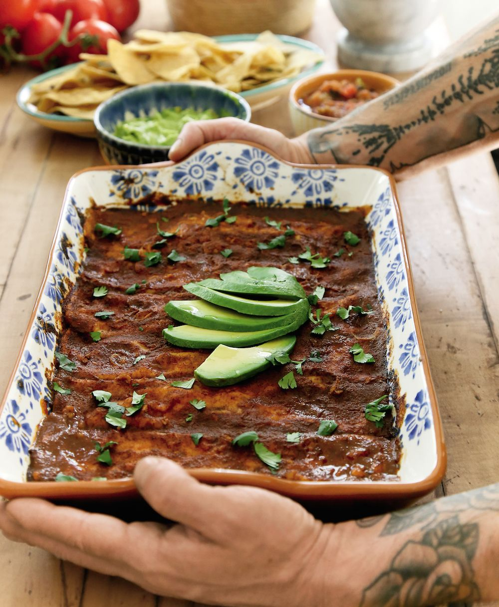

# Black Bean Enchiladas

Unreasonably tasty enchiladas. Just happen to be vegan, but cheese can be added for extra deliciousness.

## Ingredients
### Sauce
- 2 cups vegetable broth
- 1⁄3 cup tomato paste
- 2.5 tablespoons chili powder
- 2 teaspoons ground cumin
- 1½ teaspoons dried oregano
- 2 to 3 cloves garlic, minced
- 2 teaspoons soy sauce or tamari
- 1 tablespoon lime juice

### Sauce
- 1 large sweet potato (about 1 pound), diced
- 2 teaspoons olive oil
- 1/2 yellow onion, chopped
- 1 medium yellow squash or zucchini, grated
- 1 teaspoon chili powder
- 1/2 teaspoon ground cumin
- 1/2 teaspoon salt
- 2 cloves garlic, minced
- 1 can black beans
- 1 teaspoon maple / agave syrup
- Pack of tortillas
- Sliced avocado
- Chopped cilantro

## Instructions
- Make the sauce. Put everything except the lime into a saucepan and simmer for 10 - 15 minutes. Allow to cool.
- Microwave the diced sweet potato for 10 minutes, or until cooked enough to roughly mash. Mash with a fork or potato masher, leaving some chunks.
- Sautee the onion in olive oil until brown, then add squash / zucchini and cook for anouther couple of minutes. Add spices and drained black beans and allow to cook for another few minutes. Finally fold in the mashed sweet potato along with maple syrup. Turn off heat and mix until combined.
- Heat oven to 375ºF and grab a 9 x 13 in baking dish.
- Cover the bottom of the baking dish with about 1.5 cups of enchilada sauce. Dip a tortilla in a little of the sauce in the baking dish so that the bottom is all coated, then fill it with a couple spoonfuls of filling. Roll it up and set it seam-side down in the dish. Keep going until you run out of space or out of filling.
- Cover the enchiladas with the remaining sauce. Cover the dish tightly with foil and cook in the oven for 20 minutes. Take off the foil and cook it for 5 more minutes, then let cool for a minute before serving. Add sliced avocado and cilantro on top as desired.
