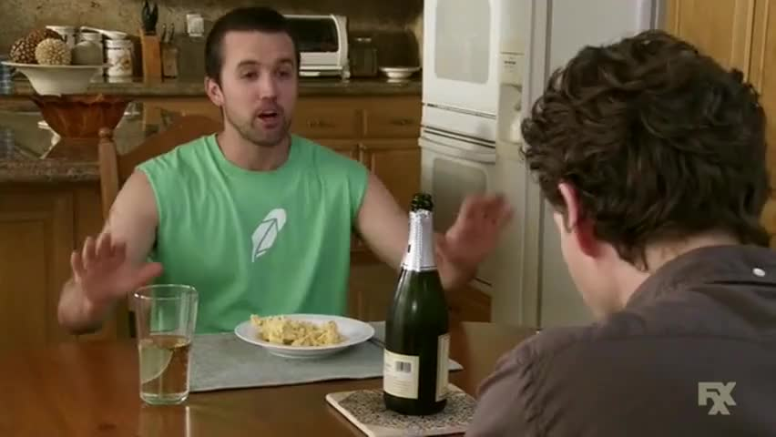

# Chance's Famous Mac and Cheese

## Ingredients

- 2 tablespoons butter
- 2 tablespoons all-purpose flour
- 1 egg
- 1 tsp salt
- 2 cups milk
- 16 oz. shredded cheese
  - I like to mix up the cheeses, but sharp cheddar is my preferred base
  - Try it with equal parts sharp white cheddar, smoked gouda, and gruyère for a one-way ticket to flavortown
  - Smoked cheeses are great if you're into that kind of thing
- 1 box 16oz pasta (macaroni, shells, penne, whatever floats your boat)
- 1 tsp smoked paprika
- Cracked white pepper to taste
  - Black pepper is fine, I just like white here to keep the dish looking clean and orangey
- **Optional:**
  - Diced green chili peppers, quantify as you see fit
  - Bread crumbs for topping

## Instructions

- Preheat oven to 350 degrees
- Bring water to a boil in a pot large enough to hold the pasta
- Boil pasta with a pinch of salt until tender, 10-12 minutes
- Drain pasta and set aside in a large oven-safe dish
- Whisk together egg, salt, milk and spices
- In a large saucepan, melt butter over medium heat
- Once butter is melted, add milk mixture to the pan
- Slowly add flour while whisking to avoid clumps
- Once the mixture is smooth, slowly add most of the cheese and stir until melted
  - Keep just enough cheese to sprinkle on the dish at the end to get a good gooey melty topping
- If using, add diced green chili peppers to the mix
- Pour cheese sauce over pasta and stir until evenly distributed amongst the noodles
- Sprinkle remaining cheese (and, if using, breadcrumbs) on top
- **Optional:** Bake for 15-30 minutes, or until the top is browned to your liking
  - If you prefer to keep things smooth and creamy, just pop it in the oven long enough to melt the cheese on top
- Eat that shit
